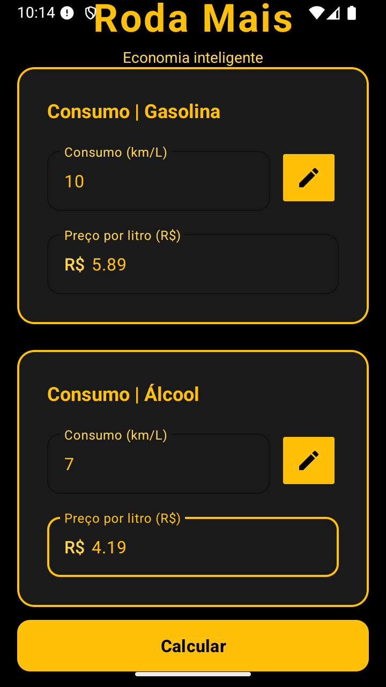
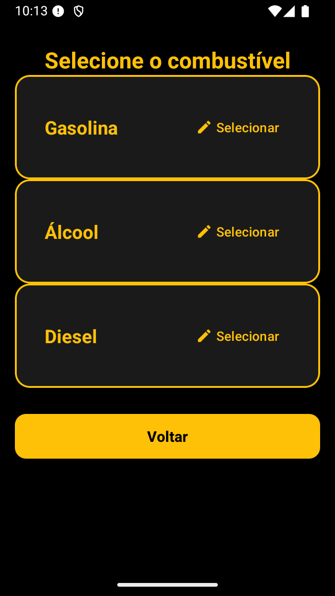
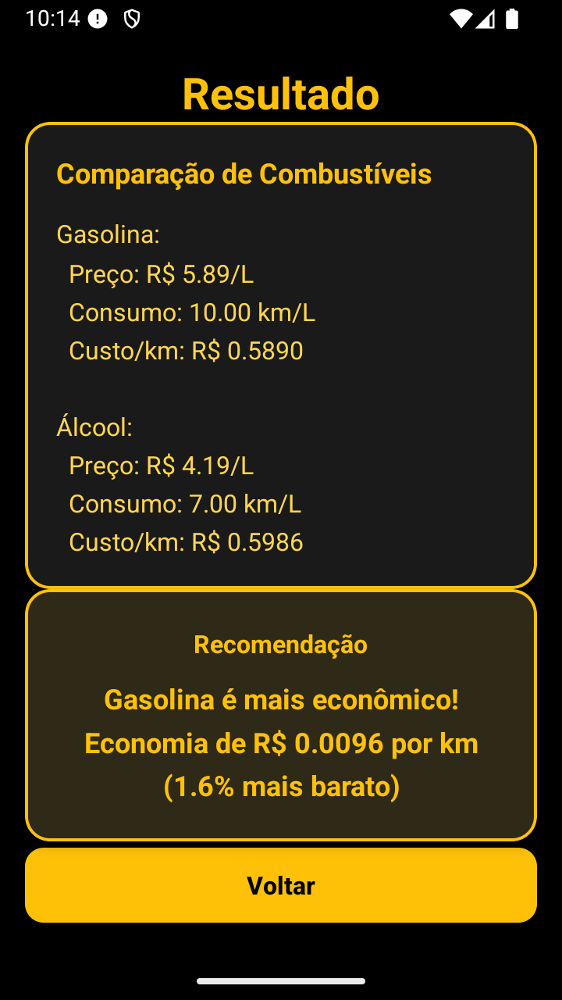

# 🚗 Roda Mais

> **Aplicativo Android para calcular qual combustível é mais econômico, comparando preço e consumo de diferentes tipos de combustível.**

[](https://kotlinlang.org/)
[](https://www.android.com/)
[](https://m3.material.io/)

---

## 📚 Documentação

📄 **[PRD - Product Requirements Document](PRD.md)** - Documento completo de requisitos do produto

Para informações detalhadas sobre requisitos funcionais, não funcionais, fluxo do usuário e especificações técnicas, consulte o [PRD](PRD.md).

---

## 📝 Sobre o Projeto

Este é um projeto de aplicativo Android desenvolvido para a disciplina de **Programação para Dispositivos Móveis da UTFPR**.

- **Instituição:** Universidade Tecnológica Federal do Paraná (UTFPR)
- **Curso:** Especialização em Programação para Dispositivos Móveis
- **Disciplina:** PM-IV - ANDROID BÁSICO
- **Professor:** Prof. Robison Cris Brito
- **Desenvolvedor:** Marcos Anjos

O **Roda Mais** é um aplicativo desenvolvido em Kotlin que ajuda motoristas a tomar decisões inteligentes na hora de abastecer. O app calcula o custo por quilômetro rodado de diferentes combustíveis e recomenda qual oferece melhor economia.

---

## ✨ Funcionalidades

- **Comparação de Combustíveis**: Compare 2 tipos de combustível diferentes (Gasolina, Álcool ou Diesel)
- **Cálculo Automático**: Calcula automaticamente o custo por quilômetro rodado
- **Recomendação Inteligente**: Indica qual combustível é mais econômico com base nos dados informados
- **Interface Moderna**: Design minimalista com tema preto e amarelo
- **Validação de Dados**: Validação completa dos campos de entrada com feedback visual
- **Reset Automático**: Limpa todos os campos ao voltar da tela de resultados
- **Economia Detalhada**: Exibe economia em reais e percentual

---

## 📷 Screenshots

<p align="center">
  
  
  
</p>

<p align="center">
  
  
</p>

---

## 🛠️ Tecnologias e Conceitos Aplicados

### Stack Tecnológica

- **Linguagem:** Kotlin
- **Framework:** Android SDK
- **UI:** Material Design 3
- **Arquitetura:** Activities (padrão Android)
- **Mínimo SDK:** 24 (Android 7.0)
- **Target SDK:** 36
- **IDE:** Android Studio

### Componentes de UI Utilizados

- `MaterialCardView` - Cards com bordas amarelas e elevação
- `TextInputLayout` e `TextInputEditText` - Campos de entrada com validação
- `MaterialButton` - Botões estilizados com Material Design 3
- `ConstraintLayout` - Layout principal responsivo
- `ScrollView` - Para suporte a telas menores
- `LinearLayout` - Organização de elementos

### Funcionalidades Técnicas

- **Navegação entre Activities**: Uso de `Intent` e `startActivityForResult`
- **Validação de Dados**: Verificação de campos obrigatórios e valores numéricos
- **Feedback Visual**: Mensagens de erro nos campos e Snackbar para erros gerais
- **Cálculo Matemático**: Cálculo preciso de custo por km rodado
- **Reset de Interface**: Limpeza automática de campos ao voltar da tela de resultados
- **Tratamento de Eventos**: `setOnClickListener` para interações do usuário

---

## 📊 Cálculo Realizado

O aplicativo calcula o **custo por quilômetro** usando a fórmula:

```
Custo por km = Preço por litro (R$) / Consumo (km/L)
```

### Processo de Comparação

1. Calcula o custo por km para cada combustível
2. Compara os dois valores
3. Identifica qual tem menor custo
4. Calcula a diferença em reais: `|Custo1 - Custo2|`
5. Calcula o percentual de economia: `(Diferença / Maior custo) × 100`

### Exemplo

- **Gasolina**: R$ 5,89/L, Consumo: 10 km/L → Custo/km: R$ 0,589
- **Álcool**: R$ 4,19/L, Consumo: 7 km/L → Custo/km: R$ 0,599
- **Resultado**: Gasolina é 1,6% mais econômica (economia de R$ 0,0096/km)

---

## 🎨 Design

O aplicativo utiliza um tema minimalista e moderno:

- **Fundo Principal**: Preto (#000000)
- **Cards**: Preto suave (#1A1A1A)
- **Cor Primária**: Amarelo (#FFC107)
- **Texto Principal**: Amarelo sobre fundo preto
- **Texto Secundário**: Amarelo claro (#FFD54F)
- **Bordas**: Amarelo (2dp) em todos os cards
- **Estilo**: Minimalista, clean e profissional

### Princípios de Design

- **Contraste**: Alto contraste entre texto amarelo e fundo preto
- **Hierarquia**: Títulos em destaque, informações secundárias em tom mais claro
- **Consistência**: Mesmo padrão visual em todas as telas
- **Acessibilidade**: Cores e tamanhos de fonte adequados

---

## 📱 Como Usar

### Passo a Passo

1. **Selecione os Combustíveis**:
   - Clique no botão de seleção (ícone de lápis) ao lado do campo "Consumo"
   - Escolha o tipo de combustível (Gasolina, Álcool ou Diesel)
   - Repita o processo para o segundo combustível

2. **Informe os Dados**:
   - Digite o consumo em km/L de cada combustível
   - Digite o preço por litro (R$) de cada combustível

3. **Calcule**:
   - Clique no botão "Calcular"
   - O sistema validará os dados automaticamente
   - Se houver erros, mensagens serão exibidas

4. **Veja os Resultados**:
   - A tela de resultados mostra:
     - Comparação detalhada dos dois combustíveis
     - Preço e consumo de cada um
     - Custo por quilômetro de cada um
     - Recomendação do mais econômico
     - Economia em reais e percentual

5. **Voltar e Resetar**:
   - Clique em "Voltar" para retornar à tela principal
   - Todos os campos serão automaticamente resetados

---

## 📂 Estrutura do Projeto

```
RodaMais/
├── app/
│   ├── src/
│   │   ├── main/
│   │   │   ├── java/com/bluestash/rodamais/
│   │   │   │   ├── MainActivity.kt          # Tela principal com formulário
│   │   │   │   ├── SelectFuelActivity.kt    # Tela de seleção de combustível
│   │   │   │   └── ResultActivity.kt        # Tela de resultados
│   │   │   ├── res/
│   │   │   │   ├── layout/                  # Layouts XML
│   │   │   │   │   ├── activity_main.xml
│   │   │   │   │   ├── activity_select_fuel.xml
│   │   │   │   │   └── activity_result.xml
│   │   │   │   ├── values/                  # Cores, temas, strings
│   │   │   │   │   ├── colors.xml
│   │   │   │   │   ├── themes.xml
│   │   │   │   │   └── strings.xml
│   │   │   │   └── drawable/                # Ícones e recursos visuais
│   │   │   └── AndroidManifest.xml
│   │   ├── test/                            # Testes unitários
│   │   └── androidTest/                     # Testes de instrumentação
│   └── build.gradle.kts                     # Configuração do módulo
├── img/                                     # Screenshots do aplicativo
│   ├── 1.png                                # Logo/Splash
│   ├── 2.png                                # Tela Principal
│   ├── 3.png                                # Formulário Preenchido
│   ├── 4.png                                # Seleção de Combustível
│   ├── 5.png                                # Tela de Resultados
│   └── pos.png                              # Banner UTFPR
├── PRD.md                                   # Product Requirements Document
├── build.gradle.kts                          # Configuração do projeto
├── settings.gradle.kts                       # Configuração do Gradle
└── README.md                                 # Este arquivo
```

---

## 🚀 Como Instalar e Executar

### Pré-requisitos

- **Android Studio** Hedgehog ou superior
- **JDK 11** ou superior
- **Android SDK** 24 ou superior
- **Gradle** 8.0 ou superior
- Dispositivo Android ou Emulador

### Passos de Instalação

1. **Clone o repositório**
   ```bash
   git clone https://github.com/seu-usuario/RodaMais.git
   cd RodaMais
   ```

2. **Abra o projeto no Android Studio**
   - Abra o Android Studio
   - Selecione "Open an existing project"
   - Navegue até a pasta do projeto e selecione

3. **Sincronize o Gradle**
   - O Android Studio irá sincronizar automaticamente
   - Aguarde a conclusão da sincronização
   - Resolva eventuais problemas de dependências

4. **Execute o aplicativo**
   - Conecte um dispositivo Android via USB (com depuração USB ativada)
   - OU inicie um emulador Android
   - Clique em "Run" (▶️) ou pressione `Shift + F10`
   - Selecione o dispositivo/emulador desejado

### Build do APK

Para gerar um APK de debug:

```bash
./gradlew assembleDebug
```

O APK estará em: `app/build/outputs/apk/debug/app-debug.apk`

---

## 📋 Requisitos do Sistema

### Requisitos Mínimos

- **Android**: 7.0 (API 24) ou superior
- **RAM**: 2GB mínimo
- **Armazenamento**: 10MB de espaço livre

### Dispositivos Testados

- ✅ Android 7.0+
- ✅ Smartphones e Tablets
- ✅ Diferentes tamanhos de tela

---

## 🧪 Testes

O projeto inclui estrutura para testes:

- **Testes Unitários**: `app/src/test/`
- **Testes de Instrumentação**: `app/src/androidTest/`

Para executar os testes:

```bash
# Testes unitários
./gradlew test

# Testes de instrumentação
./gradlew connectedAndroidTest
```

---

## 📖 Documentação Adicional

- **[PRD.md](PRD.md)** - Product Requirements Document completo
  - Requisitos funcionais e não funcionais
  - Fluxo do usuário detalhado
  - Especificações técnicas
  - Critérios de aceite

---

## 🤝 Contribuindo

Contribuições são bem-vindas! Sinta-se à vontade para:

1. Fazer um Fork do projeto
2. Criar uma branch para sua feature (`git checkout -b feature/AmazingFeature`)
3. Commit suas mudanças (`git commit -m 'Add some AmazingFeature'`)
4. Push para a branch (`git push origin feature/AmazingFeature`)
5. Abrir um Pull Request

---

## 📝 Licença

Este projeto foi desenvolvido como trabalho acadêmico para a UTFPR.

---

## 👤 Autor

**Marcos Anjos**

- **Disciplina:** PM-IV - ANDROID BÁSICO
- **Curso:** Especialização em Programação para Dispositivos Móveis
- **Instituição:** UTFPR - Universidade Tecnológica Federal do Paraná

---

## 🙏 Agradecimentos

- **Prof. Robison Cris Brito** - Orientação e ensino
- **UTFPR** - Pela oportunidade de aprendizado
- **Material Design 3** - Pela biblioteca de componentes
- **Comunidade Android** - Pelo suporte e documentação

---

## 📊 Status do Projeto

✅ **Projeto Completo e Funcional**

- ✅ Todas as funcionalidades implementadas
- ✅ Validação de dados funcionando
- ✅ Interface responsiva e moderna
- ✅ Documentação completa (README + PRD)
- ✅ Testes estruturados

---

**Desenvolvido como projeto prático para consolidar os conhecimentos em desenvolvimento Android com Kotlin, Material Design 3 e arquitetura de Activities.**

⭐ Se este projeto foi útil para você, considere dar uma estrela!
